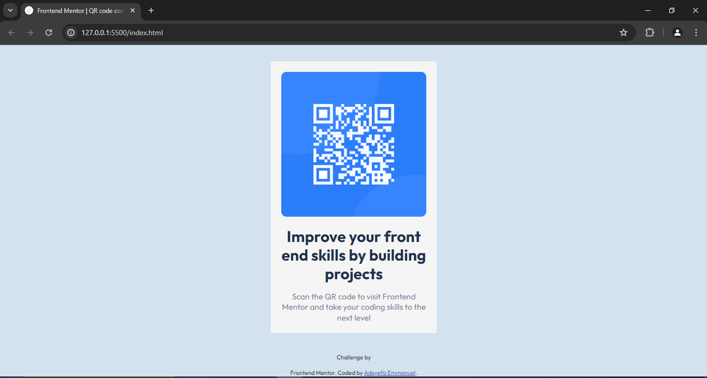
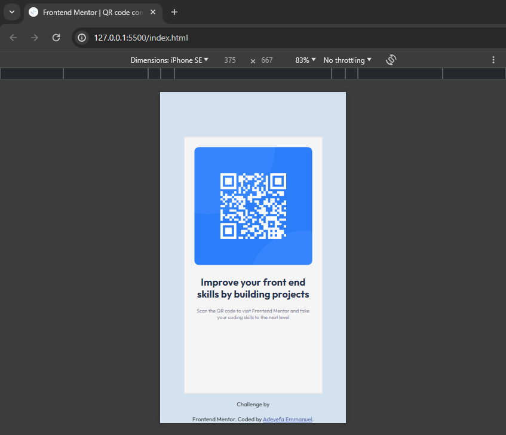

# Frontend Mentor - QR code component solution

This is a solution to the [QR code component challenge on Frontend Mentor](https://www.frontendmentor.io/challenges/qr-code-component-iux_sIO_H). Frontend Mentor challenges help you improve your coding skills by building realistic projects.

## Table of contents

- [Overview](#overview)
  - [Screenshot](#screenshot)
  - [Links](#links)
- [My process](#my-process)
  - [Built with](#built-with)
  - [What I learned](#what-i-learned)
  - [Continued development](#continued-development)
  - [Useful resources](#useful-resources)
- [Author](#author)
- [Acknowledgments](#acknowledgments)

**Note: Delete this note and update the table of contents based on what sections you keep.**

## Overview

this is a challenge of developing a qr-code-component card desognusing html and css

### Screenshot

Add a screenshot of your solution. The easiest way to do this is to use Firefox to view your project, right-click the page and select "Take a Screenshot". You can choose either a full-height screenshot or a cropped one based on how long the page is. If it's very long, it might be best to crop it.

Alternatively, you can use a tool like [FireShot](https://getfireshot.com/) to take the screenshot. FireShot has a free option, so you don't need to purchase it.

Then crop/optimize/edit your image however you like, add it to your project, and update the file path in the image above.

### Links

- Solution URL: [Add solution URL here](https://your-solution-url.com)
- Live Site URL: [Add live site URL here](https://your-live-site-url.com)

### Built with

- non semantic HTML
- CSS custom properties
- Flexbox
- CSS Grid
- Media queries for resonsive web design

### What I learned

i learnt that developing websites, one needs to pay attention to detauks and be very patient even though it nay be time consuming and overwhelming

## Author

- Frontend Mentor - [@Adesco22](https://www.frontendmentor.io/profile/Adesco22)
- Twitter - [@yourusername](https://www.twitter.com/yourusername)
- Linkedin - [@adeyefa_emmanuel](https://www.linkedin.com/emmanuel-adeyefa)
